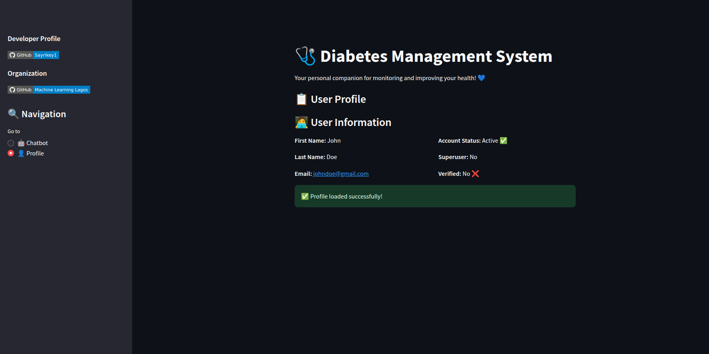
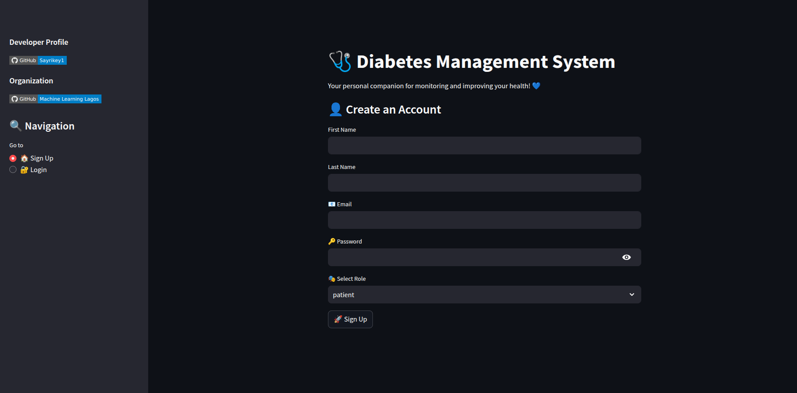
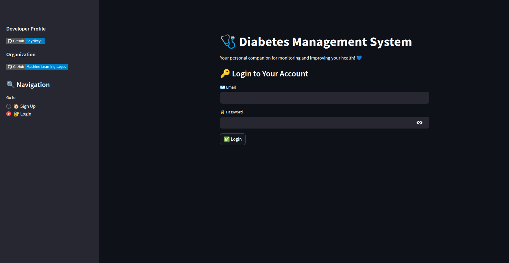

Below is the updated Markdown documentation with an added "Frontend Screenshots" section that embeds image screenshots arranged in a 2×2 grid. In this example, the images are referenced from the local directory (assumed to be available as relative paths in your repository):

---

# CreditCheck Chat Application 💬

## Overview 📋

The CreditCheck Chat Application is a web-based platform designed to assist users with credit assessments and financial guidance. It leverages a chatbot powered by advanced NLP techniques to provide seamless interactions and support for various credit-related queries. The application is built using FastAPI for the backend and Streamlit for the frontend.

## How It Works: Embedding Model & LLM Integration 🔍🤖

The backend code integrates two key AI components:

1. **Embedding Model**:  
   The application uses the [HuggingFaceEmbeddings](https://huggingface.co/sentence-transformers/all-mpnet-base-v2) class with the model **"sentence-transformers/all-mpnet-base-v2"**.  
   - **Purpose**: This transformer-based model converts text into dense vector representations (embeddings) that capture the semantic meaning of the input.  
   - **Context**: The embeddings are used to build a vector index from documents, enabling efficient similarity search and retrieval, which is crucial for a retrieval-augmented generation (RAG) pipeline.

2. **Language Model (LLM)**:  
   The language model is initialized using the [Groq](https://www.groq.com/) integration with the model **"llama-3.3-70b-versatile"**.  
   - **Purpose**: This LLM generates natural language responses based on the query context.  
   - **Context**: By coupling the semantic power of the embedding model with the generative capabilities of the LLM, the system can provide precise, context-aware responses to user queries. The Groq API handles the inference, making it possible to generate high-quality answers quickly.

These components work together within the `llama_index` framework to create a robust query engine. The embedding model encodes incoming documents and queries into vector space, while the LLM uses this information to generate responses that are both relevant and insightful.

## Features ✨

- 📝 User Registration and Authentication
- 🤖 Chatbot for Credit Assessments and Financial Guidance
- 👤 User Profile Management
- 🗂️ Conversation History

## Technologies Used 🛠️

- **Backend**: FastAPI, SQLAlchemy, Alembic, Pydantic  
- **Frontend**: Streamlit  
- **Database**: PostgreSQL  
- **AI & NLP**:  
  - **Embedding Model**: [sentence-transformers/all-mpnet-base-v2](https://huggingface.co/sentence-transformers/all-mpnet-base-v2)  
  - **Language Model**: [Groq's llama-3.3-70b-versatile](https://www.groq.com/)  
- **Other Libraries**: HuggingFace, LlamaIndex, BeautifulSoup, Requests

## Frontend Screenshots 📸

Below are some screenshots of the frontend, arranged in a 2×2 grid for a concise view:

<div style="display: grid; grid-template-columns: 1fr 1fr; gap: 10px;">
  
  
  
  
</div>

## Installation ⚙️

### Prerequisites 📌

- 🐍 Python 3.12 or higher  
- 🐘 PostgreSQL  
- 🟢 Streamlit (for frontend dependencies)

### Clone the Repository 📂

```bash
git clone https://github.com/Sayrikey1/creditcheck-chat-application.git
cd creditcheck-chat-application
```

### Backend Setup 🔧

1. **Create a virtual environment and activate it:**

```bash
python -m venv venv
source venv/bin/activate  # On Windows use `venv\Scripts\activate`
```

2. **Install the required dependencies:**

```bash
pip install -r requirements.txt
```

3. **Set up environment variables:**

Create a `.env` file in the root directory and add the following variables:

```env
DB_NAME=your_db_name
DB_PASSWORD=your_db_password
DB_HOST=your_db_host
DB_PORT=your_db_port
DB_USERNAME=your_db_username
JWT_SECRET_KEY=your_jwt_secret_key
JWT_ALGORITHM=HS256
JWT_TOKEN_EXPIRY_MINUTES=1440
GROQ_API_KEY=your_groq_api_key
```

4. **Run database migrations:**

```bash
alembic upgrade head
```

5. **Start the backend server:**

```bash
uvicorn main:app --reload
```

### Frontend Setup 🖥️

1. **Navigate to the frontend directory:**

```bash
cd frontend
```

2. **Install frontend dependencies:**

```bash
npm install
```

3. **Start the frontend application:**

```bash
streamlit run app.py
```

## Usage 🚀

### User Registration 📝

1. Open the application in your browser.
2. Navigate to the "Sign Up" page.
3. Fill in the required details and click "Sign Up".

### User Login 🔑

1. Navigate to the "Login" page.
2. Enter your email and password.
3. Click "Login".

### Chatbot Interaction 🤖

1. After logging in, navigate to the "Chatbot" page.
2. Type your message in the input box and click "Send".
3. The chatbot will respond to your queries, powered by the embedding model and LLM integration.

### User Profile 👤

1. Navigate to the "Profile" page.
2. View your user details and account status.

## Project Structure 🗂️

```
creditcheck-chat-application/
├── alembic/
│   ├── versions/
│   ├── env.py
│   ├── README
│   ├── script.py.mako
│   └── alembic.ini
├── config/
│   ├── config.py
│   └── database.py
├── dependencies/
│   ├── auth.py
│   └── error.py
├── frontend/
│   ├── app.py
│   └── requirements.txt
├── models/
│   ├── models.py
│   └── schema.py
├── rag/
│   ├── crawler.py
│   ├── data/
│   │   └── extractions.py
│   └── query_engine.py
├── routers/
│   ├── auth.py
│   └── chatbot.py
├── main.py
├── requirements.txt
└── .gitignore
```

## Contributing 🤝

Contributions are welcome! Please fork the repository and create a pull request with your changes.

## License 📄

This project is licensed under the MIT License. See the LICENSE file for details.

## Contact 📧

For any questions or inquiries, please contact [Sayrikey1](https://github.com/Sayrikey1).

---

This updated documentation highlights the integration of the embedding model and the LLM, which together enhance the application's ability to process and respond to user queries effectively. The frontend screenshots provide a visual overview of the user interface in a neatly arranged 2×2 grid. For more details on the models, refer to the provided links.