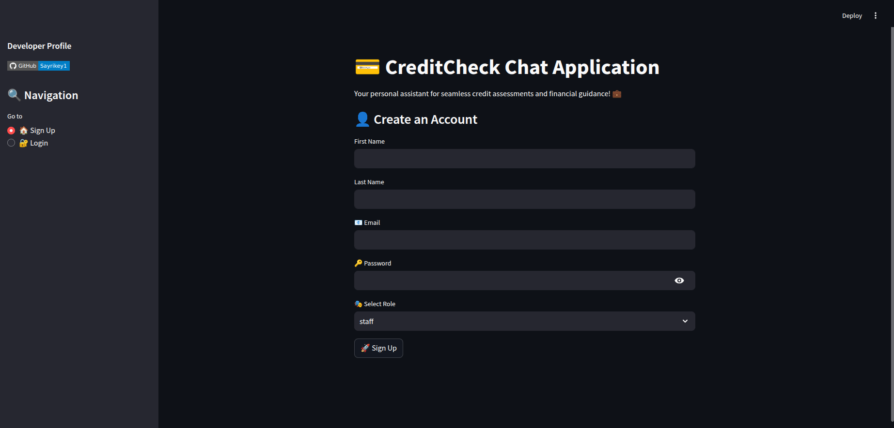
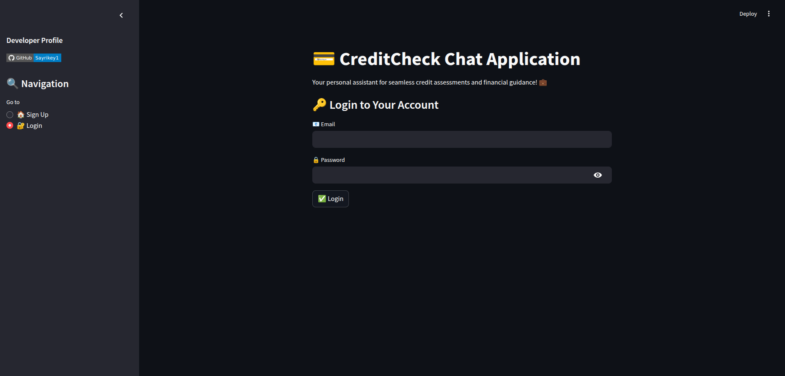
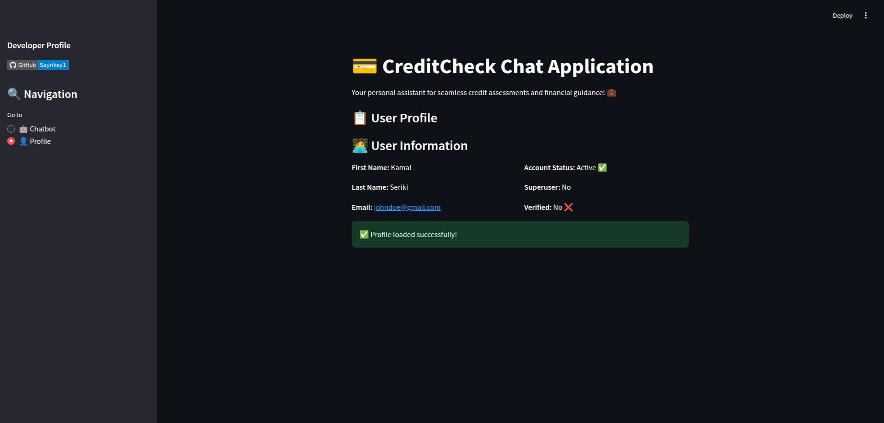
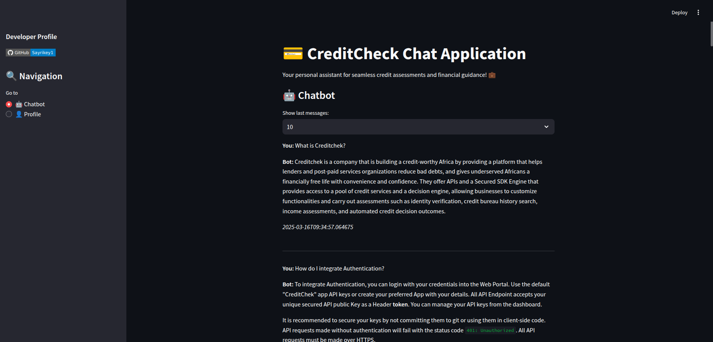
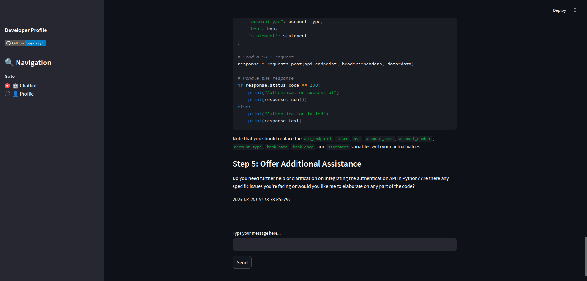

# CreditCheck Chat Application 💬

## Overview 📋

The CreditCheck Chat Application is a web-based platform designed to assist users with credit assessments and financial guidance by interacting with API documentation. It leverages a chatbot powered by advanced NLP techniques to provide seamless interactions and support for various credit-related queries. The application is built using FastAPI for the backend and Streamlit for the frontend.

## Vector Indexing Now Offset to Database

Previously, vector indexing was handled locally. Now, all vector indexing and storage are managed through a dedicated database, specifically **Pinecone** for enhanced scalability and performance. Pinecone is a managed vector database service that allows efficient similarity search over large datasets.  
[Learn more about Pinecone](https://www.pinecone.io/).

### **Important Update**:
- **Force Reload**: When new data is added, set `FORCE_RELOAD_INDEX=true` to trigger a full refresh of the vector index.

## Environment Variables Example

To configure the application, create a `.env` file in the root directory and add the following variables:

```env
DB_HOST=xxxxxxxxxxxxxxxxxxxxxxxxxxxxxxxxxxxxxx
DB_NAME=xxxxxxxxxxxxxx
DB_PASSWORD=xxxxxxxxxxxxxx
DB_PORT=5000
DB_USERNAME=xxxxxxxxxxxx

GROQ_API_KEY=gsk_xxxxxxxxxxxxxxxxxxxxxxxxxxxxxxxxxxxxxxxx 

JWT_ALGORITHM=HS256 
JWT_SECRET_KEY=xxxxxxxxxxxxxxxxxxxxxxxxxxxxxxxxxxxxxx

SQLALCHEMY_WARN_20=1   
PINECONE_API_KEY=pcsk_xxxxxxxxxxxxxxxxxxxxxxxxxxxxxxxxxxxxxxxxxxxxxxxxxxxx

FORCE_RELOAD_INDEX=true
```

Ensure that you update these values with your actual configuration when deploying the application.

## Features ✨

- 📝 User Registration and Authentication
- 🤖 Chatbot for Credit Assessments and Financial Guidance via API docs
- 👤 User Profile Management
- 🗂️ Conversation History

## Technologies Used 🛠️

- **Backend**: FastAPI, SQLAlchemy, Alembic, Pydantic  
- **Frontend**: Streamlit  
- **Database**: PostgreSQL  
- **Vector Database**: [Pinecone](https://www.pinecone.io/)  
- **AI & NLP**:  
  - **Embedding Model**: [sentence-transformers/all-mpnet-base-v2](https://huggingface.co/sentence-transformers/all-mpnet-base-v2)  
  - **Language Model**: [Groq's llama-3.3-70b-versatile](https://www.groq.com/)  
- **Other Libraries**: HuggingFace, LlamaIndex, BeautifulSoup, Requests

## Frontend Screenshots 📸

Below are some screenshots of the frontend, arranged in a 2×2 grid:

<div style="display: grid; grid-template-columns: 1fr 1fr; gap: 10px;">
  
  
  
  
  
</div>

## Installation ⚙️

### Prerequisites 📌

- 🐍 Python 3.12 or higher  
- 🐘 PostgreSQL  
- 🟢 Streamlit (for frontend dependencies)

### Clone the Repository 📂

```bash
git clone https://github.com/Sayrikey1/creditcheck-chat-application.git
cd creditcheck-chat-application
```

### Backend Setup 🔧

1. **Create a virtual environment and activate it:**

    ```bash
    python -m venv venv
    source venv/bin/activate  # On Windows use `venv\Scripts\activate`
    ```

2. **Install the required dependencies:**

    ```bash
    pip install -r requirements.txt
    ```

3. **Set up environment variables:**

    Create a `.env` file and add your database credentials, API keys, and vector indexing settings as shown in the example above.

4. **Run database migrations:**

    ```bash
    alembic upgrade head
    ```

5. **Start the backend server:**

    ```bash
    uvicorn main:app --reload
    ```

### Frontend Setup 🖥️

1. **Navigate to the frontend directory:**

    ```bash
    cd frontend
    ```

2. **Install frontend dependencies:**

    ```bash
    npm install
    ```

3. **Start the frontend application:**

    ```bash
    streamlit run app.py
    ```

## Usage 🚀

### User Registration 📝

1. Open the application in your browser.
2. Navigate to the "Sign Up" page.
3. Fill in the required details and click "Sign Up".

### User Login 🔑

1. Navigate to the "Login" page.
2. Enter your email and password.
3. Click "Login".

### Chatbot Interaction 🤖

1. Navigate to the "Chatbot" page.
2. Type your message and click "Send".
3. The chatbot will respond based on API documentation queries, using vector-indexed documents from Pinecone and LLM-generated content.

### User Profile 👤

1. Navigate to the "Profile" page.
2. View your user details and account status.

## Project Structure 🗂️

```
creditcheck-chat-application/
├── alembic/
│   ├── versions/
│   ├── env.py
│   ├── alembic.ini
├── config/
│   ├── config.py
│   └── database.py
├── dependencies/
│   ├── auth.py
│   └── error.py
├── frontend/
│   ├── app.py
│   └── requirements.txt
├── models/
│   ├── models.py
│   └── schema.py
├── rag/
│   ├── crawler.py
│   ├── data/
│   └── query_engine.py
├── routers/
│   ├── auth.py
│   └── chatbot.py
├── main.py
├── requirements.txt
└── .gitignore
```

## Contributing 🤝

Contributions are welcome! Fork the repository and submit a pull request with your changes.

## License 📄

This project is licensed under the MIT License.

## Contact 📧

For inquiries, contact [Sayrikey1](https://github.com/Sayrikey1).